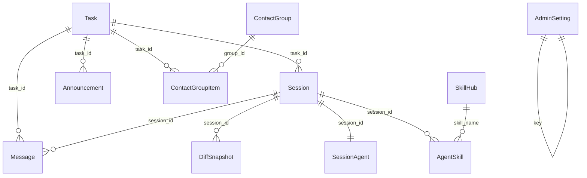

# Backend Deep Dive — 后端完整设计讲解

## 实现了什么

本文是一份后端全景设计讲解，目标是让读者读完后能完整理解 `backend/` 这一端到底负责什么、怎么启动、怎么分层、怎么持久化、怎么和 AgentEnd 通信、怎么把 Agent 的 SSE 输出稳定地送到前端。

当前后端是 AgentHub 的 HTTP API 层、业务编排层、数据持久化层和流式中转层。它本身不运行 Claude Code、OpenCode、Codex 或 Orchestrator 进程；真正的 Agent Runtime 在 `agentend/`。后端负责把前端请求转换成任务、会话、消息、技能、工作区等业务动作，并通过 AgentEnd HTTP API 触发实际 Agent 执行。

一句话概括：

> Backend 是前端与 AgentEnd 之间的稳定控制面：它保存业务状态，决定消息路由，代理工作区操作，转发 Agent 流式输出，并用 MySQL 与 Redis 让用户刷新页面、断线重连、后台清理时仍能恢复到一致状态。

本文覆盖以下内容：

| 主题 | 读完后应该理解 |
|------|----------------|
| 后端定位 | Backend 和 Frontend / AgentEnd / contracts 的边界 |
| 启动流程 | `main.go` 怎样加载配置、连接 MySQL/Redis、迁移表、组装 Controller |
| 分层架构 | Controller → Service → DAO 三层各自负责什么 |
| 数据模型 | Task、Session、Message、DiffSnapshot、SkillHub 等模型如何关联 |
| API 地图 | `/api` 下所有主要路由归属哪个 Controller 和 Service |
| 任务运行链路 | `POST /api/tasks/:taskId/run` 从请求到 AgentEnd SSE 的全过程 |
| SSE 流式中转 | RuntimeHub、Redis Stream、MySQL Message 三者怎样协作 |
| Agent 路由 | `@mention`、Orchestrator、direct、unchanged 路由怎么决策 |
| 工作区代理 | Backend 如何把 workspace 文件、diff、commit、preview 操作代理给 AgentEnd |
| 技能系统 | external skill ZIP 校验、DB blob 存储、导入到 worktree 的流程 |
| Admin API | 管理面板认证、资源、统计、工作区和会话清理的实现 |
| 失败恢复 | AgentEnd 失败、服务重启、客户端断线时如何收敛状态 |

## 怎么实现的

### 1. 后端在三端系统中的位置

项目是一个三端 Monorepo：

```text
frontend  -> React UI，负责展示任务、会话、消息流、工作区、管理面板
backend   -> Go HTTP API，负责业务状态、数据持久化、SSE 中转、AgentEnd 代理
agentend  -> Python FastAPI Agent Runtime，负责实际运行 Agent CLI、管理 worktree
contracts -> YAML 协议单一来源，生成三端类型
```

Backend 的核心边界如下：

| Backend 负责 | Backend 不负责 |
|--------------|----------------|
| 创建 Task / Session / Message | 直接启动 Claude Code、OpenCode、Codex 进程 |
| 保存任务、会话、消息、技能、公告、分组、Diff 快照 | 管理 Agent CLI 的底层进程生命周期细节 |
| 决定用户消息应该发给哪个 Agent 或 Orchestrator | 解析 Agent CLI 原始输出协议的全部内部语义 |
| 调 AgentEnd `/v1/agent/stream` 并消费 SSE | 直接编辑 Git worktree 文件系统 |
| 代理 workspace 文件读写、diff、commit、preview | 在 Go 端实现 worktree 隔离 |
| 将 AgentEnd SSE 转成前端可订阅的 SSE | 维护前端 Zustand / React Query 状态 |
| 管理 Admin 面板聚合数据 | 作为通用认证中心 |

因此，后端不是简单 CRUD 服务。它的难点主要在三个地方：

1. **业务状态必须可恢复**：Message 流式生成时，前端刷新页面后仍应看到已经生成的内容。
2. **实时输出必须低延迟**：Agent 输出 token 时，前端应尽快收到，而不是等待 DB 写入。
3. **Agent 路由必须稳定**：用户可能直接发给某个 Agent，也可能让 Orchestrator 分派给多个 Agent。

### 2. 后端目录结构与依赖方向

后端目录按运行入口、内部业务层、公共基础设施分开：

```text
backend/
├── cmd/server/main.go
├── configs/config.yaml
├── internal/
│   ├── conf/
│   ├── controller/
│   │   ├── controller.go
│   │   └── impl/
│   ├── service/
│   │   ├── service.go
│   │   ├── bizerr.go
│   │   ├── skill_validator.go
│   │   └── impl/
│   ├── dao/
│   │   ├── dao.go
│   │   ├── gorm/
│   │   └── mock/
│   ├── stream/
│   ├── middleware/
│   ├── model/
│   ├── generated/
│   └── vo/
└── pkg/
    ├── db/
    ├── redis/
    ├── agentend_client/
    ├── qiniu/
    └── storage/
```

依赖方向是：

```text
cmd/server
    ↓
controller/impl  -> vo, service interfaces, middleware, selected pkg dependencies
    ↓
service/impl     -> dao interfaces, model, generated contracts, agentend_client
    ↓
dao/gorm         -> model, pkg/db
    ↓
model
```

重要约束：

| 层 | 可以依赖 | 不应该依赖 |
|----|----------|------------|
| Controller | Gin、Service interface、vo、少量外部依赖构造参数 | GORM 查询细节、大段业务规则 |
| Service | DAO interface、model、generated contract、AgentEnd client | `gin.Context`、HTTP 响应格式 |
| DAO | GORM、model、db singleton | Gin、vo、AgentEnd client |
| stream | DAO interface、Redis client、generated event contract | Controller 或 Gin |

`internal/stream/` 是一个特殊底层能力包。它不属于普通 Controller / Service / DAO 三层中的任何一层，但它通过 DAO 接口写 MySQL，而不是直接在业务代码中散落数据库逻辑。

### 3. 启动流程：`cmd/server/main.go`

后端入口只有一个：`cmd/server/main.go`。启动顺序非常重要，因为后续组件依赖前面已经完成初始化。

启动链路：

```text
读取 configs/config.yaml 和 .env
    ↓
初始化 MySQL 单例
    ↓
AutoMigrate 所有 GORM 模型
    ↓
初始化 Redis 单例
    ↓
清理残留 streaming 消息
    ↓
启动 RuntimeHub closedKeys 清理 goroutine
    ↓
创建 AgentEnd client
    ↓
创建 storage.Provider
    ↓
构造 13 组 Controller
    ↓
挂载 Gin middleware
    ↓
注册 /ping、/health、/api 路由
    ↓
启动 HTTP server :8080
    ↓
监听 SIGINT / SIGTERM，15 秒优雅关闭
```

关键行为：

| 步骤 | 代码位置 | 作用 |
|------|----------|------|
| 配置加载 | `internal/conf/conf.go` | YAML + `.env`，七牛云密钥用环境变量覆盖 |
| MySQL 初始化 | `pkg/db/mysql.go` | `sync.Once` 单例，连接池最大 25 open / 10 idle |
| 表迁移 | `cmd/server/main.go` | `AutoMigrate` 11 个模型 |
| Redis 初始化 | `pkg/redis/redis.go` | go-redis client，连接池 10，启动时必须 ping 成功 |
| 残留消息清理 | `internal/stream/writer.go` | 将服务重启前遗留的 `streaming` Message 标记为 `failed` |
| Hub 清理 | `internal/stream/hub.go` | 每 10 分钟清空 closed stream key 记录 |
| 存储选择 | `pkg/storage/factory.go` | 有七牛云密钥则七牛云，否则本地磁盘 |
| 中间件 | `internal/middleware/` | logger、CORS、recovery |
| 优雅关闭 | `cmd/server/main.go` | 收到信号后 `srv.Shutdown(ctx)`，最多等 15 秒 |

后端服务端口固定在 `:8080`。健康检查有两个入口：

| 路由 | 响应 |
|------|------|
| `GET /ping` | `{"code":0,"data":{"message":"pong"}}` |
| `GET /health` | `{"code":0,"data":{"status":"ok"}}` |

### 4. 配置系统

配置类型定义在 `internal/conf/conf.go`，主配置文件是 `backend/configs/config.yaml`。

配置段：

| 配置段 | Go 类型 | 用途 |
|--------|---------|------|
| `mysql` | `MySQLConfig` | MySQL host、port、user、password、dbname、charset |
| `jwt` | `JWTConfig` | JWT secret 和普通 token 过期时间 |
| `agentend` | `AgentEndConfig` | AgentEnd host 和 port |
| `redis` | `RedisConfig` | Redis host、port、password、db |
| `admin` | `AdminConfig` | 管理员密码，支持明文和 bcrypt hash |
| `qiniu` | `QiniuConfig` | 七牛云 bucket、domain、region，密钥从 `.env` 注入 |
| `storage` | `StorageConfig` | `qiniu`、`local` 或空字符串自动检测 |
| `cors` | `CORSConfig` | 允许跨域来源 |

配置加载顺序：

```text
godotenv.Load()
    ↓
os.ReadFile("configs/config.yaml")
    ↓
yaml.Unmarshal()
    ↓
cfg.Qiniu.AccessKey = os.Getenv("QINIU_ACCESS_KEY")
cfg.Qiniu.SecretKey = os.Getenv("QINIU_SECRET_KEY")
```

几个关键点：

| 点 | 说明 |
|----|------|
| `.env` 可选 | 不存在不会导致启动失败 |
| 七牛云密钥不写入 YAML | `QINIU_ACCESS_KEY` 和 `QINIU_SECRET_KEY` 从环境变量读取 |
| Storage 自动检测 | `storage.type` 为空时，有七牛云密钥用七牛云，否则本地 |
| CORS 默认值 | 如果 `cors.allow_origins` 为空，默认允许 `http://localhost:5173` |
| Admin 密码 | `admin.password` 如果以 `$2a$` 或 `$2b$` 开头就走 bcrypt，否则兼容明文 |

### 5. 统一响应与错误模型

所有普通 JSON API 都通过 `internal/vo/response.go` 返回统一结构：

```go
type Response struct {
	Code int         `json:"code"`
	Data interface{} `json:"data,omitempty"`
	Msg  string      `json:"msg,omitempty"`
}
```

成功响应：

| 函数 | HTTP 状态码 | code |
|------|-------------|------|
| `vo.OK` | 200 | 0 |
| `vo.Created` | 201 | 0 |
| `vo.Accepted` | 202 | 0 |

错误响应：

| 函数 | HTTP 状态码 | code |
|------|-------------|------|
| `vo.BadRequest` | 400 | 400 |
| `vo.Unauthorized` | 401 | 401 |
| `vo.Forbidden` | 403 | 403 |
| `vo.NotFound` | 404 | 404 |
| `vo.Conflict` | 409 | 409 |
| `vo.ServiceUnavailable` | 503 | 503 |
| `vo.InternalError` | 500 | 500 |

业务错误类型定义在 `internal/service/bizerr.go`：

```go
type BizError struct {
	Code    int
	Message string
}
```

Service 层通过 `service.ErrBadRequest`、`service.ErrNotFound`、`service.ErrConflict` 这类函数返回业务语义。Controller 层的 `handleBizError` 统一映射到 `vo` 响应。

这带来的好处：

| 问题 | 解决方式 |
|------|----------|
| Service 不依赖 Gin | Service 只返回普通 `error` |
| Controller 不写重复 switch | `handleBizError` 统一处理 |
| 错误语义清晰 | `ErrConflict("skill already imported")` 比普通字符串更明确 |
| 测试更容易 | Service 单测只断言 error 类型和 Code |

### 6. Controller 层：HTTP 入站边界

Controller 实现放在 `internal/controller/impl/`。每个 Controller 基本遵循同一模式：

```text
NewXxxController()
    ↓
创建需要的 DAO
    ↓
创建 Service
    ↓
返回带 Service interface 字段的 Controller

RegisterRoutes(rg)
    ↓
把当前模块路由挂载到 /api 下

具体 Handler
    ↓
绑定 path/query/body/form 参数
    ↓
调用 Service
    ↓
vo.OK / vo.Created / vo.Accepted / handleBizError
```

以 TaskController 为例：

```text
NewTaskController(agentClient)
    ↓
gormdao.NewTaskDao()
gormdao.NewSessionDao()
gormdao.NewMessageDao()
gormdao.NewDiffSnapshotDao()
    ↓
svcimpl.NewTaskService(taskDao, sessionDao, messageDao, diffDao, agentClient)
    ↓
TaskController{service, agentClient}
```

Controller 层的职责边界：

| Controller 应该做 | Controller 不应该做 |
|-------------------|---------------------|
| `ShouldBindJSON` / query 参数解析 | 复杂业务状态判断 |
| multipart 文件读取和大小格式初筛 | 手写 SQL |
| 设置 SSE 响应头 | 决定 Agent 路由规则 |
| 调 Service 并返回 vo 响应 | 直接操作 GORM 模型 |
| 少量纯代理操作 | 跨表事务 |

`WorkspaceController` 是一个特例：它主要是 AgentEnd workspace API 的 HTTP 代理，当前没有独立 Service / DAO。它负责路径清洗、session 到 workspace id 解析、转发请求和透传响应。

### 7. Service 层：业务规则所在

Service 接口和 DTO 集中定义在 `internal/service/service.go`。实现放在 `internal/service/impl/`。

核心 Service：

| Service | 主要职责 |
|---------|----------|
| `TaskService` | Task CRUD、创建会话、消息路由、触发 AgentEnd、review plan |
| `MessageService` | 消息历史分页、群聊窗口消息 |
| `SessionService` | Session 状态修改 |
| `StreamService` | 前端 SSE 订阅：历史内容、Redis 补偿、Hub 实时事件 |
| `AgentProfileService` | Agent profile/detail/soul、技能同步 |
| `AvatarService` | 头像上传、Session 元数据更新 |
| `DiffSnapshotService` | Diff 快照查询、保存、终态保护 |
| `AnnouncementService` | 任务公告 CRUD，取消置顶时通知 AgentEnd |
| `ContactGroupService` | 联系人分组和任务分组项 |
| `SkillService` | skill ZIP 校验、入库、导入 worktree、删除 |
| `AdminService` | 管理面板认证、资源、统计、工作区、Agent 配置聚合 |

Service 层最重要的设计原则：

1. **纯业务逻辑**：不接收 `*gin.Context`。
2. **通过接口依赖 DAO**：构造函数接收 `dao.XxxDao`，便于 mock。
3. **返回业务错误**：能预期的错误用 `BizError`。
4. **外部服务调用集中在 Service**：例如 AgentEnd client 多数由 Service 调用。
5. **跨表业务由 Service 编排，事务由 DAO 封装**：Service 决定要做什么，DAO 决定如何原子写库。

### 8. DAO 层：数据访问与事务边界

DAO 接口定义在 `internal/dao/dao.go`，GORM 实现在 `internal/dao/gorm/`。

DAO 组：

| DAO | 负责的模型与动作 |
|-----|------------------|
| `TaskDao` | Task 查询、Task+Session 创建事务、任务删除级联、SessionAgent 查询 |
| `SessionDao` | Session 查询、状态更新、SoulMD 更新、SessionAgent 同步更新 |
| `MessageDao` | Message 查询、分页、创建、状态更新、流式内容写入、群聊窗口查询 |
| `DiffSnapshotDao` | DiffSnapshot 查询、Upsert、pending 自动取消 |
| `AnnouncementDao` | Announcement 列表、创建、删除 |
| `ContactGroupDao` | ContactGroup 和 ContactGroupItem CRUD |
| `SkillDao` | SkillHub、AgentSkill、skill blob、导入关系 |
| `AdminDao` | AdminSetting、批量删除 Session、统计查询 |

事务边界主要在 DAO 内：

| 事务 | 文件 | 内容 |
|------|------|------|
| 创建任务 | `dao/gorm/task_dao.go` | 同事务写 Task、多个 Session、多个 SessionAgent |
| 删除任务 | `dao/gorm/task_dao.go` + `cascade.go` | 删除 Task 后清理 Message、SessionAgent、DiffSnapshot、Session、Announcement |
| 删除会话 | `dao/gorm/admin_dao.go` + `cascade.go` | 批量删除指定 Session 和关联消息/快照/Agent |
| 删除联系人分组 | `dao/gorm/contact_group_dao.go` | 删除 group item 后删除 group |
| 删除技能 | `dao/gorm/skill_dao.go` | 删除 AgentSkill 关联后删除 SkillHub |
| 更新 Session 元数据 | `dao/gorm/session_dao.go` | 更新 Session，同时同步 SessionAgent 的 agent 字段 |
| 替换 Admin setting | `dao/gorm/admin_dao.go` | 先删旧 KV，再插入新 KV |

DAO 返回 `nil, nil` 表示记录不存在，这是当前代码的常见约定。Service 看到空对象后转换成 `ErrNotFound`。

### 9. 数据模型全景

模型定义在 `internal/model/`。启动时 `main.go` 对以下模型执行 `AutoMigrate`：

```text
Session
Task
Message
DiffSnapshot
SessionAgent
AdminSetting
Announcement
ContactGroup
ContactGroupItem
SkillHub
AgentSkill
```

关系可以这样理解：



当前代码没有用 GORM 外键约束强制这些关系，而是用字段约定和 DAO 级联清理维护一致性。

#### Task

`Task` 是顶层任务实体：

| 字段 | 作用 |
|------|------|
| `ID` | MySQL 自增主键 |
| `TaskID` | UUID，业务主键，唯一索引 |
| `Title` | 任务标题 |
| `RepoPath` | 关联的仓库路径，传给 AgentEnd |
| `Status` | 默认 `active` |
| `PinnedAt` | 置顶时间，空表示未置顶 |
| `CreatedAt` / `UpdatedAt` | GORM 时间戳 |

Task 是 UI 左侧任务列表和 Agent worktree 隔离的基础。AgentEnd 会根据 `task_id` 和 repo path 创建任务级 worktree 结构。

#### Session

`Session` 表示某个 Task 下某个 Agent 的会话：

| 字段 | 作用 |
|------|------|
| `SessionID` | UUID 或前端/路由传入的业务会话 ID |
| `TaskID` | 所属 Task |
| `AgentType` | `claude-code`、`opencode`、`orchestrator`、`codex` |
| `AgentName` | UI 显示名称 |
| `AvatarURL` | Agent 头像 |
| `Status` | `active`、`running`、`completed`、`failed`、`inactive`、`awaiting_review`、`cleaned` |
| `SettledDiff` | 已结算 Diff 内容 |
| `DiffStatus` | Diff 状态 |
| `SoulMD` | Agent 个性描述，保存时去掉空格，最多 300 字符 |

Session 同时影响三件事：

1. 前端展示某个 Agent 的聊天栏。
2. AgentEnd 通过 session id 管理 CLI 会话和 worktree。
3. 后端用 session id 过滤 Message、DiffSnapshot、Skill 导入关系。

#### SessionAgent

`SessionAgent` 是 Session 的 Agent 元信息镜像：

| 字段 | 作用 |
|------|------|
| `SessionID` | 与 Session 关联，唯一索引 |
| `AgentType` | Agent 类型 |
| `AgentName` | Agent 名称 |
| `AvatarURL` | 头像 |

它存在的原因是 Task 详情需要快速拿到 Session 与 Agent 展示信息，头像和名称修改时 `SessionDao.UpdateFields` 会同步更新 Session 和 SessionAgent。

#### Message

`Message` 是聊天历史和流式恢复的核心表：

| 字段 | 作用 |
|------|------|
| `MessageID` | UUID，业务主键 |
| `TaskID` | 所属任务 |
| `SessionID` | 所属会话 |
| `Role` | `user` 或 `agent` |
| `Content` | 消息正文，Agent 流式输出会不断覆盖式写入完整内容 |
| `Status` | `streaming`、`completed`、`failed` |
| `LastSeq` | Redis Stream 最后写入序号，用于断线补偿 |
| `AgentType` / `AgentName` | Agent 输出消息的来源 |
| `GroupID` | Orchestrator 群聊/分组输出的组标识 |
| `CreatedAt` | 创建时间 |

Message 有两个重要索引：

| 索引 | 作用 |
|------|------|
| `message_id` unique | 根据业务 message id 找到消息 |
| `session_id` / `session_id,status` | 按会话查消息和清理 streaming 消息 |

流式输出时，Message 的状态从 `streaming` 变成 `completed` 或 `failed`。如果服务重启时还有 `streaming`，启动逻辑会统一标记为 `failed`，避免前端一直等一个不会再产生事件的消息。

#### DiffSnapshot

`DiffSnapshot` 保存工作区 diff 快照：

| 字段 | 作用 |
|------|------|
| `SnapshotID` | 快照业务 ID，唯一索引 |
| `SessionID` | 对应会话 |
| `DiffContent` | unified diff 文本 |
| `Status` | `pending`、`committed`、`reverted`、`cancelled` |

规则：

| 规则 | 代码位置 |
|------|----------|
| 保存 pending 快照时，取消同 Session 其他 pending 快照 | `DiffSnapshotService.SaveDiffSnapshot` |
| `committed` / `reverted` / `cancelled` 是终态 | `isTerminalDiffSnapshotStatus` |
| 终态快照不可再次覆盖 | `DiffSnapshotService.SaveDiffSnapshot` |
| PlanReview 事件会创建 pending DiffSnapshot | `StreamWriter.persistPlanReviewEvent` |

#### Announcement

`Announcement` 是任务公告：

| 字段 | 作用 |
|------|------|
| `TaskID` | 所属任务 |
| `SenderID` / `SenderName` | 发送者信息 |
| `Content` | 公告正文 |
| `Pinned` | 是否置顶 |

列表查询按 `pinned DESC, created_at DESC` 排序。删除置顶公告时，后端会异步通知 AgentEnd 的 pin 模块，让 Agent 侧同步取消公告 pin。

#### ContactGroup 与 ContactGroupItem

联系人分组拆成两张表：

| 表 | 作用 |
|----|------|
| `ContactGroup` | 分组本身，含 `group_id`、名称、排序 |
| `ContactGroupItem` | 分组项，把 `group_id` 与 `task_id` 关联起来 |

`ContactGroupService.ListGroups` 会同时返回：

1. 已分组的 groups 和 items。
2. 当前 active Task 中尚未出现在任何 group item 的 `ungrouped_task_ids`。

#### SkillHub 与 AgentSkill

技能系统也拆成两张表：

| 表 | 作用 |
|----|------|
| `SkillHub` | 统一技能仓库，包含 builtin 和 external skill |
| `AgentSkill` | 某个 Session 导入了哪个 external skill |

重要字段：

| 字段 | 表 | 作用 |
|------|----|------|
| `SkillHub.Name` | `skill_hubs` | 技能名，唯一索引 |
| `SkillHub.Builtin` | `skill_hubs` | builtin skill 不允许删除 |
| `SkillHub.Content` | `skill_hubs` | external skill 的 ZIP blob，`longblob` |
| `SkillHub.StoragePath` | `skill_hubs` | 已废弃字段，迁移后不再依赖本地路径 |
| `AgentSkill.SessionID` | `agent_skill` | 导入技能的会话 |
| `AgentSkill.SkillName` | `agent_skill` | 技能名 |
| `AgentSkill.AgentType` | `agent_skill` | 导入时所属 Agent 类型 |

#### AdminSetting

`AdminSetting` 是简单 KV 表：

| 字段 | 作用 |
|------|------|
| `Key` | 主键 |
| `Value` | 字符串值 |

当前主要用于保存管理员头像 URL。没有配置时返回默认 DiceBear 头像。

### 10. API 地图

所有业务路由挂在 `/api` 下，健康检查除外。

#### Task 与 Agent 路由

| 方法 | 路由 | Controller | Service | 说明 |
|------|------|------------|---------|------|
| `POST` | `/api/tasks` | `TaskController.CreateTask` | `TaskService.CreateTask` | 创建 Task 和初始 Sessions |
| `GET` | `/api/tasks` | `TaskController.ListTasks` | `TaskService.ListTasks` | 获取任务列表，置顶优先 |
| `GET` | `/api/tasks/:taskId` | `TaskController.GetTask` | `TaskService.GetTask` | 获取任务详情和 Session/Agent 信息 |
| `DELETE` | `/api/tasks/:taskId` | `TaskController.DeleteTask` | `TaskService.DeleteTask` | 删除任务和关联数据 |
| `DELETE` | `/api/tasks/:taskId/leave` | `TaskController.LeaveTask` | `TaskService.LeaveTask` | 退出任务并尽力清理 AgentEnd session/workspace/branch |
| `PATCH` | `/api/tasks/:taskId` | `TaskController.PatchTask` | `TaskService.PatchTask` | 更新置顶时间 |
| `POST` | `/api/tasks/:taskId/run` | `TaskController.RunTask` | `TaskService.RunTask` | 发送用户消息并触发 Agent 执行 |
| `POST` | `/api/tasks/:taskId/review` | `TaskController.ReviewTask` | `TaskService.ReviewTask` | 提交 Orchestrator plan review 结果 |
| `POST` | `/api/validate-repo-path` | `TaskController.ValidateRepoPath` | AgentEnd client | 校验 repo path |
| `POST` | `/api/init-git-repo` | `TaskController.InitGitRepo` | AgentEnd client | 初始化 Git repo |
| `GET` | `/api/agent-types` | `AgentController.ListAgentTypes` | 无 | 返回四种 Agent 类型 |

#### Message 与 Stream

| 方法 | 路由 | Controller | Service | 说明 |
|------|------|------------|---------|------|
| `GET` | `/api/tasks/:taskId/messages` | `MessageController.ListMessages` | `MessageService.ListMessages` | 消息列表，支持 cursor 分页和 mode 过滤 |
| `GET` | `/api/tasks/:taskId/messages/window` | `MessageController.WindowMessages` | `MessageService.WindowMessages` | 取群聊窗口消息，供 Agent 上下文 |
| `GET` | `/api/tasks/:taskId/stream` | `StreamController.ServeStream` | `StreamService.ServeStream` | 前端 EventSource 订阅某条 Agent 消息 |

`/stream` 的必需 query 参数：

| 参数 | 说明 |
|------|------|
| `session_id` | Agent 消息所属 Session |
| `message_id` | 要订阅的 Agent Message ID |

#### Session、Profile、Avatar、Diff

| 方法 | 路由 | Controller | Service | 说明 |
|------|------|------------|---------|------|
| `PATCH` | `/api/sessions/:sessionId` | `SessionController.PatchSession` | `SessionService.PatchSessionStatus` | 当前只允许改为 `inactive` |
| `GET` | `/api/sessions/:sessionId/profile` | `AgentProfileController.GetProfile` | `AgentProfileService.GetProfile` | Agent 简要档案 |
| `GET` | `/api/sessions/:sessionId/detail` | `AgentProfileController.GetDetail` | `AgentProfileService.GetDetail` | Agent 详情、repo、workspace、消息数、技能 |
| `GET` | `/api/sessions/:sessionId/soul` | `AgentProfileController.GetSoul` | `AgentProfileService.GetSoul` | 获取 SoulMD |
| `PUT` | `/api/sessions/:sessionId/soul` | `AgentProfileController.UpdateSoul` | `AgentProfileService.UpdateSoul` | 更新 SoulMD |
| `POST` | `/api/agents/avatar` | `AvatarController.UploadAvatar` | `AvatarService.UploadAvatar` | 上传 Agent 头像 |
| `PUT` | `/api/sessions/:sessionId` | `AvatarController.UpdateSession` | `AvatarService.UpdateSession` | 更新 agent_name / avatar_url |
| `GET` | `/api/diff-snapshots/:snapshotId` | `DiffSnapshotController.GetDiffSnapshot` | `DiffSnapshotService.GetDiffSnapshot` | 查询 diff 快照 |
| `PUT` | `/api/diff-snapshots/:snapshotId` | `DiffSnapshotController.SaveDiffSnapshot` | `DiffSnapshotService.SaveDiffSnapshot` | 保存或更新 diff 快照 |

注意：`PUT /api/sessions/:sessionId` 和 `PATCH /api/sessions/:sessionId` 是两个不同用途，前者更新显示信息，后者更新状态。

#### Workspace 代理

| 方法 | 路由 | 行为 |
|------|------|------|
| `GET` | `/api/workspace/task/:taskId/git-info` | 代理到 AgentEnd 任务 Git 信息 |
| `POST` | `/api/workspace/task/:taskId/merge-to-main` | 代理合并任务分支 |
| `GET` | `/api/workspace/:id/files/*filepath` | 直接按 workspace id 读文件 |
| `PUT` | `/api/workspace/:id/files/*filepath` | 直接按 workspace id 写文件 |
| `GET` | `/api/workspace/:id/diff` | 获取 workspace diff |
| `POST` | `/api/workspace/:id/commit` | 提交 workspace |
| `POST` | `/api/workspace/:id/revert` | 回滚 workspace |
| `POST` | `/api/workspace/:id/preview/start` | 启动预览 |
| `POST` | `/api/workspace/:id/preview/stop` | 停止预览 |
| `GET` | `/api/session/:sessionId/files/*filepath` | 先由 session 查 workspace id，再读文件 |
| `PUT` | `/api/session/:sessionId/files/*filepath` | 先由 session 查 workspace id，再写文件 |
| `GET` | `/api/session/:sessionId/diff` | Session 级 diff |
| `POST` | `/api/session/:sessionId/commit` | Session 级 commit |
| `POST` | `/api/session/:sessionId/revert` | Session 级 revert |

Session 级 workspace 路由会先请求 AgentEnd：

```text
GET /v1/workspace/by-session/:sessionId
```

拿到 workspace id 后再代理到真实 workspace API。

#### 公告、联系人分组、技能

| 方法 | 路由 | Controller | Service | 说明 |
|------|------|------------|---------|------|
| `GET` | `/api/tasks/:taskId/announcements` | `AnnouncementController.ListAnnouncements` | `AnnouncementService.ListAnnouncements` | 任务公告列表，可用 `pinned=true` |
| `POST` | `/api/tasks/:taskId/announcements` | `AnnouncementController.CreateAnnouncement` | `AnnouncementService.CreateAnnouncement` | 创建公告 |
| `DELETE` | `/api/tasks/:taskId/announcements/:id` | `AnnouncementController.DeleteAnnouncement` | `AnnouncementService.DeleteAnnouncement` | 删除公告，置顶公告会通知 AgentEnd |
| `GET` | `/api/contact-groups` | `ContactGroupController.ListGroups` | `ContactGroupService.ListGroups` | 分组和未分组任务 |
| `POST` | `/api/contact-groups` | `ContactGroupController.CreateGroup` | `ContactGroupService.CreateGroup` | 创建分组 |
| `PUT` | `/api/contact-groups/:groupId` | `ContactGroupController.UpdateGroup` | `ContactGroupService.UpdateGroup` | 更新分组名称 |
| `DELETE` | `/api/contact-groups/:groupId` | `ContactGroupController.DeleteGroup` | `ContactGroupService.DeleteGroup` | 删除分组及 items |
| `POST` | `/api/contact-groups/:groupId/items` | `ContactGroupController.AddItem` | `ContactGroupService.AddItem` | 添加 task 到分组 |
| `DELETE` | `/api/contact-groups/:groupId/items/:taskID` | `ContactGroupController.RemoveItem` | `ContactGroupService.RemoveItem` | 从分组移除 task |
| `POST` | `/api/skills/upload` | `SkillController.Upload` | `SkillService.UploadSkill` | 上传并校验 skill ZIP |
| `POST` | `/api/skills/confirm` | `SkillController.Confirm` | `SkillService.ConfirmSkill` | 确认入库 |
| `GET` | `/api/skills` | `SkillController.List` | `SkillService.ListSkills` | 技能列表 |
| `DELETE` | `/api/skills/:name` | `SkillController.Delete` | `SkillService.DeleteSkill` | 删除 external skill |
| `POST` | `/api/skills/:name/import` | `SkillController.Import` | `SkillService.ImportSkill` | 导入 skill 到某个 Session worktree |
| `DELETE` | `/api/skills/:name/sessions/:sessionId` | `SkillController.Remove` | `SkillService.RemoveSkill` | 从 Session worktree 移除 skill |
| `POST` | `/api/internal/builtin-skills` | `SkillController.ReportBuiltinSkills` | `SkillService.ReportBuiltinSkills` | AgentEnd 上报 builtin skills |

#### Admin

公开 Admin 路由：

| 方法 | 路由 | 说明 |
|------|------|------|
| `POST` | `/api/admin/auth` | 管理员密码认证，5 次/分钟/IP |
| `GET` | `/api/admin/health` | 管理面板健康检查 |
| `GET` | `/api/admin/avatar` | 获取管理员头像 |

需要 Admin JWT Bearer Token 的路由：

| 方法 | 路由 | 说明 |
|------|------|------|
| `GET` | `/api/admin/resources` | 资源概览，AgentEnd 磁盘/内存 + Redis memory |
| `DELETE` | `/api/admin/sessions` | 批量删除 Session |
| `GET` | `/api/admin/workspaces` | 工作区概览 |
| `DELETE` | `/api/admin/workspaces/:id` | 清理 workspace 并标记 Session cleaned |
| `GET` | `/api/admin/agents` | 读取 Agent 配置 |
| `GET` | `/api/admin/services` | 检查 Frontend / Backend / AgentEnd 可达性 |
| `GET` | `/api/admin/statistics` | 会话和消息统计 |
| `PUT` | `/api/admin/avatar` | 更新管理员头像 URL |

### 11. 创建任务链路

入口：

```text
POST /api/tasks
```

请求体对应 `service.CreateTaskInput`：

| 字段 | 必填 | 说明 |
|------|------|------|
| `title` | 是 | 任务标题 |
| `repo_path` | 否 | 仓库路径 |
| `agents` | 否 | 初始 Agent 列表，每项有 `type` 和 `name` |

执行步骤：

```text
TaskController.CreateTask
    ↓
绑定 JSON 到 CreateTaskInput
    ↓
TaskService.CreateTask
    ↓
校验 orchestrator 不能是唯一 agent
    ↓
生成 task_id
    ↓
为每个 agent 生成 session_id
    ↓
构造 Session 与 SessionAgent
    ↓
TaskDao.CreateTaskWithSessions
    ↓
MySQL transaction 写 Task、Sessions、SessionAgents
```

为什么 Orchestrator 不能是唯一 Agent：

Orchestrator 的职责是拆解任务、审查计划、协调其他 Agent。如果任务里只有 Orchestrator 而没有可执行的普通 Agent，调度结果没有实际目标，所以 Service 层直接拒绝这种创建。

任务创建后的基本状态：

| 对象 | 初始状态 |
|------|----------|
| Task | `active` |
| Session | `active` |
| SessionAgent | 记录 agent type/name/avatar |

### 12. 任务详情链路

入口：

```text
GET /api/tasks/:taskId
```

执行步骤：

```text
TaskService.GetTask
    ↓
TaskDao.GetByTaskID(taskID)
    ↓
SessionDao.ListByTaskID(taskID)
    ↓
TaskDao.ListSessionAgentsBySessionIDs(sessionIDs)
    ↓
合并 Session 与 SessionAgent 的 agent 信息
    ↓
buildRouteAgents(enrichedSessions)
    ↓
返回 TaskDetailResponse
```

返回结构重点：

| 字段 | 说明 |
|------|------|
| `task` | Task 本体 |
| `sessions` | Session 列表，额外包含 AgentType、AgentName、AvatarURL、RouteID、MentionLabel、Aliases |

`RouteID`、`MentionLabel`、`Aliases` 会被前端用于 `@mention` 自动补全和消息路由。

### 13. Agent 消息路由策略

路由逻辑在 `internal/service/impl/task_route.go`。核心函数是 `resolveMessageRoute`。

路由输入：

| 输入 | 来源 |
|------|------|
| 用户消息 `message` | `RunTaskInput.Message` |
| 当前 session id | `RunTaskInput.SessionID` |
| 显式 agent type | `RunTaskInput.AgentType` |
| 任务下所有 sessions | `SessionDao.ListByTaskID` |
| `skip_user_message` | 用于系统内部继续发送，不落用户消息 |

路由输出：

| 字段 | 说明 |
|------|------|
| `Mode` | `direct`、`orchestrator`、`unchanged` |
| `SessionID` | 最终要发给哪个 Session |
| `AgentType` | 最终 Agent 类型 |
| `AgentName` | Agent 名称 |
| `RouteID` | 路由展示 ID |
| `AgentMessage` | 真正发给 AgentEnd 的消息 |
| `DisplayMessage` | 保存到用户消息里的内容 |

规则按优先级执行：

| 场景 | 行为 |
|------|------|
| `skip_user_message=true` | 不解析多 Agent 路由，只尽量填充当前 Session 的 Agent 信息 |
| 消息开头是单个普通 Agent mention | direct，发给被 mention 的 Agent，并去掉开头 mention |
| 消息开头 mention 了 Orchestrator | 发给 Orchestrator，消息去掉 mention |
| 消息开头有多个 mention 或 `@all` | 必须存在 Orchestrator，发给 Orchestrator |
| 没有 mention，但任务中存在 Orchestrator 且 session 数大于 1 | 默认发给 Orchestrator |
| 没有 mention，也不满足 Orchestrator 条件 | unchanged，发给请求里的 session |

Alias 构造规则：

| 来源 | 例子 |
|------|------|
| RouteID | `Claude-2` |
| AgentName | 用户配置的显示名 |
| AgentType | `claude-code` |
| 内置别名 | `Claude Code`、`OpenCode`、`Codex`、`Orchestrator` |

同名 Agent 会自动追加序号，避免多个 Agent 的 mention 标签冲突。

### 14. 运行任务链路：`POST /api/tasks/:taskId/run`

这是后端最重要的业务链路。

请求体对应 `service.RunTaskInput`：

| 字段 | 必填 | 说明 |
|------|------|------|
| `message` | 是 | 用户输入 |
| `session_id` | 是 | 当前 UI 会话 |
| `agent_type` | 否 | 未传时从 Session 推断，兜底 `claude-code` |
| `cwd` | 否 | 指定 workspace path，优先于 repo path |
| `skip_user_message` | 否 | 是否跳过保存用户消息 |

完整链路：

```text
TaskController.RunTask
    ↓
TaskService.RunTask
    ↓
读取 Task，不存在则 404
    ↓
读取当前 Task 下所有 Sessions
    ↓
resolveMessageRoute 决定最终目标 Session 和 Agent
    ↓
如果 skip_user_message=false，保存 user Message
    ↓
TaskDao.EnsureSession 确保目标 Session 存在并置为 running
    ↓
必要时创建 SessionAgent
    ↓
创建 agent Message，状态 streaming
    ↓
buildAgentRequest 组装 AgentEnd 请求
    ↓
启动 goroutine runStream
    ↓
立即返回 202 Accepted
```

为什么先创建 Agent Message 再启动 goroutine：

前端调用 run 接口后，需要立刻拿到 `message_id`。随后前端用这个 `message_id` 打开 EventSource：

```text
GET /api/tasks/:taskId/stream?session_id=<session_id>&message_id=<message_id>
```

如果不先创建 Message，前端就没有稳定的订阅目标，也无法刷新后恢复流式内容。

`RunTaskResult` 返回：

| 字段 | 说明 |
|------|------|
| `message_id` | 新建的 Agent Message ID |
| `status` | 固定为 `streaming` |
| `session_id` | 实际路由后的 Session |
| `agent_type` | 实际路由后的 Agent 类型 |
| `agent_name` | Agent 名称 |
| `route_id` | 路由 ID |
| `route_mode` | `direct`、`orchestrator` 或 `unchanged` |

### 15. AgentRequest 组装

`TaskService.buildAgentRequest` 会把后端业务状态转换成 contracts 生成的 `generated.AgentRequest`：

| AgentRequest 字段 | Backend 来源 |
|-------------------|--------------|
| `task_id` | Task.TaskID |
| `session_id` | RunTaskInput.SessionID，已被路由修正 |
| `message` | RunTaskInput.Message，可能已去掉开头 mention |
| `agent_type` | 路由后的 AgentType |
| `stream` | 固定 `true` |
| `group_chat_messages` | `FetchGroupChatWindow` |
| `workspace_path` | 优先使用请求里的 `cwd` |
| `repo_path` | 如果没有 `cwd`，使用 Task.RepoPath |
| `config` | 普通 Agent 是 `soul_md`，Orchestrator 是 agents/orchestrator/repo/shared_dir |

普通 Agent 的 config：

| 字段 | 说明 |
|------|------|
| `soul_md` | 当前 Session 的 SoulMD，传给 AgentEnd 注入个性描述 |

Orchestrator 的 config：

| 字段 | 说明 |
|------|------|
| `agents` | 当前任务下非 Orchestrator 的 Agent 列表 |
| `task_id` | 当前任务 ID |
| `soul_md` | Orchestrator 自己的 SoulMD |
| `orchestrator` | Orchestrator 自身 id/type/session/name |
| `repo_path` | 绝对 repo path |
| `shared_dir` | `worktrees/<task_id>/shared/.agent` |

`group_chat_messages` 的作用是给 AgentEnd 提供跨 Agent 上下文。它来自同一 Task 下其他 Session 的消息，长度最多 2000 个 rune，并且会按 AgentName、AgentType、Content 去重。

### 16. `runStream`：调用 AgentEnd 并交给 StreamWriter

`TaskService.runStream` 在后台 goroutine 中运行。它负责：

1. 调 AgentEnd `/v1/agent/stream`。
2. 校验 HTTP 状态码。
3. 逐行读取 AgentEnd 返回的 SSE。
4. 把每一行交给 `stream.StreamWriter`。
5. 根据 StreamWriter 结果更新 Session 状态。

失败处理：

| 失败点 | 后端行为 |
|--------|----------|
| goroutine panic | recover，向流写 error，Message failed，Session failed |
| AgentEnd 请求失败 | `PublishErrorAndFail`，Session failed |
| AgentEnd 返回非 200 | `PublishErrorAndFail`，Session failed |
| SSE 读取错误 | StreamWriter 返回 failed，Session failed |
| 正常结束 | Message completed，Session completed |

SSE 读取保护：

| 保护 | 说明 |
|------|------|
| Reader buffer | `bufio.NewReaderSize(resp.Body, 64*1024)` |
| 单行大小 | 超过 10MB 视为错误 |
| 忽略 `event:` 行 | 当前只处理 `data:` 行和非空行 |

### 17. 前端订阅链路：`StreamService.ServeStream`

前端订阅：

```text
GET /api/tasks/:taskId/stream?session_id=<session_id>&message_id=<message_id>
```

`StreamController` 会设置 SSE 响应头：

| Header | 值 |
|--------|----|
| `Content-Type` | `text/event-stream` |
| `Cache-Control` | `no-cache` |
| `Connection` | `keep-alive` |
| `X-Accel-Buffering` | `no` |

然后调用 `StreamService.ServeStream`。

`ServeStream` 先查 MySQL Message：

| Message 状态 | 行为 |
|--------------|------|
| `streaming` | 进入实时流式模式 |
| `failed` | 输出已有 content，再输出 error 事件 |
| 其他状态 | 输出已有 content，再输出 done 事件 |

streaming 模式分成四段：

```text
1. 先把 MySQL 中已经写入的 content 切块输出
2. 再从 Redis Stream 用 last_seq 读取缺口事件
3. 然后订阅 RuntimeHub 接收实时事件
4. 循环中发送 heartbeat，并用 stale timer 兜底检查 DB 终态
```

这样设计解决了三个问题：

| 问题 | 解决方式 |
|------|----------|
| 前端刷新页面 | MySQL content 先恢复已有文本 |
| 刷新时错过部分实时事件 | Redis Stream 从 `last_seq` 后补偿 |
| 最新 token 低延迟 | RuntimeHub 内存 channel 实时推送 |
| 后端 goroutine 已结束但 Hub 事件丢失 | stale timer 重新查 DB 状态并收尾 |

### 18. RuntimeHub：内存实时通道

`internal/stream/hub.go` 实现全局单例 `Hub`：

```text
RuntimeHub
    ├── streams: map[string]*RuntimeStream
    └── closedKeys: map[string]struct{}
```

stream key 使用 Redis 相同格式：

```text
agent:<session_id>:<message_id>
```

核心方法：

| 方法 | 作用 |
|------|------|
| `Publish(key, data)` | 非阻塞推送 SSE data 行给所有订阅者 |
| `Subscribe(key)` | 创建 1024 buffer 的订阅 channel |
| `Unsubscribe(key, ch)` | 客户端断开后移除订阅 |
| `Close(key)` | 发送 Done sentinel、关闭 channel、删除 stream |
| `StartClosedKeysCleanup()` | 每 10 分钟清空 closedKeys |

`closedKeys` 很关键。它防止一个已经关闭的 stream 被客户端迟到重连重新创建。如果没有这个机制，前端可能在流结束后重新订阅，一个空 Hub stream 被创建出来，导致客户端继续等待。

### 19. Redis Stream：断线补偿通道

Redis key 由 `pkg/redis.StreamKey` 生成：

```text
agent:<session_id>:<message_id>
```

写入方式：

| 写入内容 | 函数 | 说明 |
|----------|------|------|
| 非 TEXT 原始 SSE 行 | `publishToRedis` | 同时发 Hub 和 Redis |
| TEXT 批量合并后的 SSE 行 | `flushTextBuffer` | 只写 Redis，因为单个 token 已经发过 Hub |
| error 事件 | `PublishErrorAndFail` | Hub + Redis |

Redis Stream 参数：

| 常量 | 值 | 用途 |
|------|----|------|
| `maxStreamLen` | 10000 | XADD 近似最大长度 |
| `streamExpireTTL` | 600s | 流结束后 Redis key 过期时间 |
| `textBatchSize` | 2048 bytes | TEXT 合并写 Redis 的大小阈值 |
| `textBatchAge` | 500ms | TEXT 合并写 Redis 的时间阈值 |

Message 表的 `last_seq` 保存最近一次 Redis XADD 返回的 ID。前端重连时，`StreamService` 从这个 ID 后读取 Redis 缺口。

### 20. MySQL Message：最终可恢复内容

`StreamWriter` 不会每个 token 都写 MySQL。它用内存 buffer 合并文本，并按两个条件触发刷写：

| 条件 | 值 |
|------|----|
| 内容增量阈值 | 2048 bytes |
| 定时刷写 | 500ms |

刷写方式是“覆盖式写入完整 content”，不是 SQL 追加：

```text
当前完整 buffer content
    ↓
MessageDao.UpdateMessageContentAndSeq(messageID, content, lastSeq)
```

覆盖式写入的优点：

| 优点 | 说明 |
|------|------|
| 恢复简单 | MySQL 中永远保存当前完整正文 |
| 幂等性更好 | 重试写入同样内容不会重复追加 |
| 与 runtime block 兼容 | AskCard、PlanReview 等可作为 marker 直接插入 content |

### 21. StreamWriter 消费 AgentEnd SSE

`StreamWriter.Run` 接收一个扫描函数。扫描函数每读到一行 SSE，就调用 StreamWriter 提供的 callback。

StreamWriter 对 `generated.StreamEvent.Type` 做分发：

| EventType | 行为 |
|-----------|------|
| `text` | 解析文本、agent metadata、message_id、group_id，决定是否切换子消息，然后写 Hub/Redis/MySQL buffer |
| `done` | flush TEXT buffer |
| `error` | flush TEXT buffer，追加 `[Error]`，最终状态 failed |
| `ask_card_start` | 持久化 ask_agent runtime block，状态 pending |
| `ask_card_done` | 更新 ask_agent runtime block，状态 answered/failed/pending |
| `plan_review` | 写 plan_review block，保存 pending DiffSnapshot，Session 进入 `awaiting_review` |
| `planning` | 写 legacy plan runtime block |
| `runtime_executing` | 写 runtime_status block |
| `runtime_completed` | 写 runtime_status block |
| `coordination_message` | 写 coordination block |
| `coordination_done` | 写 coordination closed block |
| 其他事件 | 先 flush TEXT buffer，再把原始 SSE 行写 Redis/Hub |

`text` 事件最复杂，因为 Orchestrator 可能在一个 SSE 流里输出多个 Agent 的内容。

### 22. Agent 输出拆分与 group_id

普通单 Agent 输出时，一个 Agent Message 就够了。Orchestrator 场景下，一个流里可能出现：

1. Orchestrator 自己的文本。
2. 子 Agent A 的输出。
3. 子 Agent B 的输出。
4. 同一个 group 下多个 Agent 的交错输出。
5. 来自其他 Session 的转发文本。

StreamWriter 用这些字段判断是否要切换当前 Message：

| 字段 | 来源 | 作用 |
|------|------|------|
| `agent_type` | SSE content | 当前文本属于哪个 Agent 类型 |
| `agent` | SSE content | 当前文本属于哪个 Agent 名称 |
| `message_id` | SSE content | AgentEnd 提供的上游逻辑消息边界 |
| `group_id` | SSE content | Orchestrator 分组输出 |

切换时执行：

```text
flush 当前 buffer
    ↓
必要时把当前子消息标记 completed
    ↓
创建或复用目标 Message
    ↓
更新 currentAgentType/currentAgentName/currentSourceID/groupID
    ↓
后续文本写入新 Message
```

group 模式下，StreamWriter 用 `groupID + agentType + agentName` 作为 key，保证同一组、同一 Agent 的输出写到同一条子消息，而不是每次切换都创建新消息。

### 23. 转发不持久化机制

Orchestrator 可能把其他 Session 已经产生的文本转发到当前流里。为了避免同一段内容在当前 Session 的 MySQL Message 中重复存储，StreamWriter 会调用：

```text
MessageDao.FindSessionIDByTaskMessage(taskID, sourceMessageID)
```

如果 `sourceMessageID` 属于其他 Session：

| 行为 | 说明 |
|------|------|
| 仍然通过 Hub/Redis 发给当前 SSE 订阅者 | 前端能实时看到上下文 |
| 不写入当前 Session 的 MySQL Message | 避免重复持久化 |
| 设置 `splitAfterForward` | 下一段本地内容到来时自动拆成新 Message |

### 24. PlanReview 与 DiffSnapshot

当 AgentEnd 发出 `plan_review` 事件时，StreamWriter 做三件事：

1. 从事件中读取 `diff_snapshot_id` 和 `diff`。
2. 调 `DiffSnapshotDao.UpsertPending` 保存 pending diff。
3. 把 plan review 内容写成 `type: plan_review` runtime block，插入当前 Message content。
4. 把 Session 状态改为 `awaiting_review`。

前端提交 review：

```text
POST /api/tasks/:taskId/review
```

`ReviewTask` 允许三种 action：

| action | content 是否必需 | 结果 |
|--------|------------------|------|
| `approve` | 否 | 提交 approve，block 状态改为 `approved` |
| `discuss` | 是 | 提交讨论内容，block 状态改为 `submitted` |
| `modify` | 是 | 提交修改要求，block 状态改为 `submitted` |

提交后，Backend 调 AgentEnd `/v1/agent/review`，然后用 `markLatestPlanReviewBlock` 把最近一条 plan_review block 里的 `"status":"pending"` 替换成目标状态，并把 Session 改回 `running`。

### 25. 消息历史分页与 group 可见性

入口：

```text
GET /api/tasks/:taskId/messages
```

参数：

| 参数 | 说明 |
|------|------|
| `limit` | 分页大小，默认 20 |
| `before` | 使用 MySQL 自增 `id` 作为 cursor，查 `id < before` |
| `session_id` | 普通模式下按 Session 过滤 |
| `mode` | `group` 时启用群聊可见性规则 |
| `primary_session_id` | group 模式下主 Session |

无分页参数时：

```text
按 created_at ASC、id ASC 返回全部匹配消息
has_more=false
```

有分页参数时：

```text
DAO 按 id DESC 多查一条
    ↓
Service 判断 has_more
    ↓
截断到 limit
    ↓
reverseMessages 变成旧到新
```

为什么用自增 `id` 做 cursor：

| 原因 | 说明 |
|------|------|
| 单调递增 | 比 `created_at` 更适合做稳定 cursor |
| 唯一 | 不会有同毫秒时间戳冲突 |
| 查询简单 | `WHERE id < ? ORDER BY id DESC LIMIT ?` |

group 模式下，`MessageDao.applyGroupMessageVisibility` 会让前端看到：

1. 所有用户消息。
2. primary session 的消息。
3. 带非空 group_id 的 agent 消息。
4. 其他 session 中还没有被后续 agent 回复覆盖的用户上下文相关 agent 消息。

这段 SQL 是为了让群聊视图既能保留主线，又不会把所有子 Agent 历史无限制混进当前窗口。

### 26. Workspace 代理

Workspace 相关真实能力在 AgentEnd。Backend 的 `WorkspaceController` 做代理和少量安全处理。

代理模式有两种：

| 模式 | 例子 | 说明 |
|------|------|------|
| 直接 workspace id | `/api/workspace/:id/diff` | 前端已经知道 workspace id |
| Session 解析 | `/api/session/:sessionId/diff` | Backend 先问 AgentEnd `by-session` 拿 workspace id |

文件路径会经过 `sanitizePath`：

| 禁止 | 原因 |
|------|------|
| `..` | 防止路径穿越 |
| `../` 前缀 | 防止跳出 workspace |
| 任意路径段为 `..` | 防止中间路径穿越 |

代理函数 `proxy` 会：

```text
构造 AgentEnd URL
    ↓
继承请求 context
    ↓
透传 Content-Type
    ↓
发送 HTTP 请求
    ↓
复制响应 header
    ↓
写回原始状态码和响应 body
```

因此，workspace API 的语义主要由 AgentEnd 决定，Backend 只是稳定地把前端请求转过去。

### 27. 技能系统

技能系统有三类动作：

1. AgentEnd 上报 builtin skills。
2. 用户上传 external skill 到 hub。
3. 用户把 external skill 导入某个 Session 的 worktree。

#### 上传校验

入口：

```text
POST /api/skills/upload
```

Controller 从 multipart form 的 `file` 字段读取 ZIP bytes。Service 调 `service.ValidateZip`。

校验规则：

| 规则 | 说明 |
|------|------|
| 必须是合法 ZIP | `zip.NewReader` 能打开 |
| 不能路径穿越 | 文件名不能包含 `..` |
| 不能是绝对路径 | `filepath.IsAbs` 为 false |
| 不能包含符号链接 | `os.ModeSymlink` 不允许 |
| 解压总大小限制 | 10MB |
| 文件数量限制 | 100 |
| 必须包含 `SKILL.md` | 根目录或一级目录 |
| `SKILL.md` 必须有 frontmatter | `---` 包裹 YAML |
| frontmatter 必须有 `name` | 作为 skill 名 |
| ZIP 文件名必须匹配 skill name | `foo.zip` 对应 `name: foo` |
| 不能和 builtin skill 重名 | 查 `SkillHub` builtin 记录 |

校验通过后返回 `ValidationResult`，其中含 `tmp_dir`。随后前端调用 confirm。

#### 确认入库

入口：

```text
POST /api/skills/confirm
```

`SkillService.ConfirmSkill` 执行：

```text
检查 SkillHub 是否已有同名 skill
    ↓
PackValidatedSkillDir 把 tmp_dir 重新打成 zip
    ↓
CreateSkill 写入 SkillHub
    ↓
删除 tmp_dir
```

external skill 的 ZIP 内容保存在 `SkillHub.Content`，类型是 `longblob`。

#### 导入到 Session

入口：

```text
POST /api/skills/:name/import
```

执行步骤：

```text
查 Session
    ↓
只允许 claude-code / opencode / codex
    ↓
查 SkillHub
    ↓
检查是否已经导入
    ↓
读取 SkillHub.Content
    ↓
AgentEnd InstallSkill 写入 worktree
    ↓
创建 AgentSkill 关联
```

Orchestrator 不支持导入 external skill，因为 Orchestrator 是调度者，不是实际执行某个技能目录的普通 Agent。

### 28. Agent Profile 与技能同步

Agent profile 有两个来源：

1. 优先问 AgentEnd：`GET /v1/skills/:agentType?session_id=:sessionId`。
2. AgentEnd 失败或返回空时，从 DB 回退。

为什么要优先问 AgentEnd：

| 原因 | 说明 |
|------|------|
| worktree 是真实状态 | 某些技能可能已经安装到工作区 |
| builtin skills 来自 AgentEnd | Go Backend 不扫描 Agent Runtime 技能目录 |
| DB 只是缓存和 hub 视角 | 用于展示和导入关系管理 |

拿到 AgentEnd 技能列表后，Backend 会同步到 DB：

| skill 类型 | 同步行为 |
|------------|----------|
| builtin | Upsert 到 SkillHub，不写 AgentSkill |
| external | Upsert 到 SkillHub，并 EnsureAgentSkill(sessionID, skillName, agentType) |

`GetDetail` 还会返回：

| 字段 | 来源 |
|------|------|
| `RepoPath` | Task.RepoPath |
| `WorkspacePath` | `filepath.Join(filepath.Dir(repoPath), "worktrees", taskID, sessionID)` |
| `MessageCount` | `MessageDao.CountBySessionID` |

### 29. 头像上传与存储抽象

头像入口：

```text
POST /api/agents/avatar
```

Controller 限制：

| 限制 | 值 |
|------|----|
| 表单字段 | `avatar` |
| 最大大小 | 2MB |
| 扩展名 | `.jpg`、`.jpeg`、`.png`、`.gif`、`.webp` |

Service 生成对象 key：

```text
avatars/<uuid><ext>
```

然后调用 `storage.Provider.UploadBytes`。

Provider 实现：

| 实现 | 条件 | 行为 |
|------|------|------|
| `QiniuStorage` | `storage.type=qiniu` 或自动检测到七牛云密钥 | 使用七牛云 SDK 上传，返回公开 URL |
| `LocalStorage` | `storage.type=local` 或没有七牛云密钥 | 写入本地 `uploads/`，由 Gin `r.Static("/uploads", dir)` 提供访问 |

更新 Session 显示信息：

```text
PUT /api/sessions/:sessionId
```

可更新字段：

| 字段 | 行为 |
|------|------|
| `agent_name` | 更新 Session 和 SessionAgent |
| `avatar_url` | 更新 Session 和 SessionAgent |

两个字段都为空时返回 400。

### 30. 公告与 pin 通知

公告属于 Task。创建和列表都是普通 MySQL 操作。

特殊逻辑在删除置顶公告：

```text
DeleteAnnouncement
    ↓
AnnouncementDao.DeleteAnnouncement
    ↓
如果 announcement.Pinned=true
    ↓
异步 notifyUnpin
    ↓
TaskDao.FindRepoPathByTaskID
    ↓
根据 repo path 拼 shared_dir
    ↓
AgentEnd NotifyAnnouncementUnpin
```

`shared_dir` 拼法：

```text
filepath.Join(filepath.Dir(absRepoPath), "worktrees", taskID, "shared", ".agent")
```

通知失败只写 warn 日志，不影响删除公告的 HTTP 响应。

### 31. Admin API

AdminController 将路由分成公开和受保护两组。

认证：

```text
POST /api/admin/auth
    ↓
IPRateLimiter 5 requests / minute / IP
    ↓
VerifyAdminPassword
    ↓
GenerateAdminToken
    ↓
返回 token，有效期 3600 秒
```

Admin JWT claim：

| claim | 值 |
|-------|----|
| `admin` | `true` |
| `exp` | 当前时间 + 1 小时 |

受保护路由使用 `middleware.AdminAuth`：

```text
Authorization: Bearer <token>
```

AdminService 聚合的数据源：

| 功能 | 数据源 |
|------|--------|
| 头像 | `AdminSetting` KV |
| Agent 配置 | AgentEnd `/v1/agents/configs` |
| 服务状态 | HTTP 检查 Frontend、Backend、AgentEnd |
| 资源 | AgentEnd `/v1/resources` + Redis `INFO memory` |
| 会话清理 | MySQL Session + Message + DiffSnapshot + SessionAgent |
| 统计 | MySQL Session / Message |
| 工作区 | MySQL Session + AgentEnd `/v1/workspace` |
| 清理 workspace | AgentEnd cleanup + Session 状态改 `cleaned` |

当前统计中 `storageDays` 是固定模拟值，真实磁盘历史统计尚未从持久化数据源计算。

### 32. AgentEnd client

Backend 通过 `pkg/agentend_client/client.go` 调 AgentEnd。

基础 URL：

```text
<agentend.host>:<agentend.port>
```

如果 host 没有协议头，client 会补 `http://`。

主要 AgentEnd API：

| Backend 方法 | AgentEnd 路由 | 用途 |
|--------------|---------------|------|
| `StreamAgent` | `POST /v1/agent/stream` | 运行 Agent 并返回 SSE |
| `ReviewAgent` | `POST /v1/agent/review` | 提交 plan review |
| `ValidateRepoPath` | `POST /v1/validate-repo-path` | 校验 repo path |
| `InitGitRepo` | `POST /v1/init-git-repo` | 初始化 git repo |
| `HealthCheck` | `GET /health` | 健康检查 |
| `GetResources` | `GET /v1/resources` | 资源信息 |
| `GetAgentConfigs` | `GET /v1/agents/configs` | Agent 配置 |
| `NotifyAnnouncementUnpin` | `POST /v1/pin/announcement-unpin` | 公告取消 pin |
| `DestroySession` | `DELETE /v1/session/:sessionId` | 销毁 AgentEnd session |
| `CleanupByTask` | `DELETE /v1/workspace/task/:taskId` | 清理任务 workspaces |
| `CleanupTaskBranches` | `POST /v1/workspace/task/:taskId/cleanup-branches` | 强制清理任务分支 |
| `FetchSkills` | `GET /v1/skills/:agentType?session_id=:sessionId` | 获取技能 |
| `InstallSkill` | `POST /v1/skills/:agentType/:skillName/install?session_id=:sessionId` | 安装 external skill |
| `RemoveSkill` | `DELETE /v1/skills/:agentType/:skillName?session_id=:sessionId` | 移除 skill |
| `ListWorkspaces` | `GET /v1/workspace` | workspace 列表 |
| `CleanupWorkspace` | `DELETE /v1/workspace/:workspaceID` | 清理单 workspace |

AgentEnd client 有两个 HTTP client：

| client | 超时策略 | 用途 |
|--------|----------|------|
| `httpClient` | 60 秒 timeout | 普通 JSON API |
| `streamClient` | 不设置整体 timeout，只设置 response header timeout | SSE 长连接 |

### 33. contracts 生成类型如何被后端使用

`backend/internal/generated/` 是由 `make generate` 从 `contracts/schemas/` 生成的 Go 类型。不要手改。

后端实际用到的关键生成类型：

| 文件 | 类型 | 用途 |
|------|------|------|
| `request.go` | `AgentRequest`、`AgentType` | 发送给 AgentEnd |
| `events.go` | `StreamEvent`、`EventType` | 解析 AgentEnd SSE data |
| `agent_routing.go` | `RouteMode`、`RunTaskRequest`、`RunTaskResponse` | 与前端路由协议对齐 |
| `message.go` | `MessageRole`、`MessageStatus` | 与消息状态契约对齐 |

最关键的是 `StreamEvent`：

```go
type StreamEvent struct {
	Type EventType `json:"type"`
	Content map[string]interface{} `json:"content,omitempty"`
	Timestamp float64 `json:"timestamp,omitempty"`
}
```

AgentEnd 的 SSE data 行会被解析成这个结构，StreamWriter 再按 `Type` 决定是写普通 text、runtime block、plan review，还是 error/done。

### 34. 失败恢复与一致性设计

#### 服务重启

启动时：

```text
stream.CleanupStaleMessages(gormdao.NewMessageDao())
```

会把所有 `status = streaming` 的 Message 改成 `failed`。

原因：

如果 Backend 重启了，原来的 `runStream` goroutine 已经消失，AgentEnd SSE 连接也不再由该进程消费。继续保留 `streaming` 会让前端误以为还能收到事件。

#### AgentEnd 不可用

`RunTask` 创建 Agent Message 后，后台 `runStream` 如果调用 AgentEnd 失败，会：

```text
stream.PublishErrorAndFail
    ↓
Hub.Publish error event
    ↓
Redis XADD error event
    ↓
Message status = failed
    ↓
Hub.Close
    ↓
Session status = failed
```

前端如果已经连上 SSE，会收到 error；如果稍后刷新，也会从 MySQL 看到 failed 状态。

#### 前端断线重连

断线重连时，`StreamService.serveStreaming` 按顺序恢复：

```text
MySQL content
    ↓
Redis Stream gap after last_seq
    ↓
RuntimeHub live channel
```

即使 Hub 中某些内存事件错过了，Redis 也会补偿；即使 Redis 已过期，MySQL 仍有最终 content。

#### Hub 已关闭但客户端迟到订阅

RuntimeHub 关闭 stream 时会把 key 放入 `closedKeys`。迟到订阅不会重新创建 stream。closedKeys 每 10 分钟清理一次。

#### 删除任务和清理外部资源

`LeaveTask` 比 `DeleteTask` 多做 AgentEnd 清理：

```text
查 Task 和 sessionIDs
    ↓
逐个 DestroySession，失败只 warn
    ↓
CleanupByTask，失败只 warn
    ↓
CleanupTaskBranches，失败只 warn
    ↓
DeleteTaskCascade 删除 DB 数据
```

外部清理采用 best-effort，不因为 AgentEnd 清理失败而阻塞 DB 删除。

### 35. 测试文件与验证入口

当前后端有以下测试文件：

| 文件 | 关注点 |
|------|--------|
| `internal/service/impl/message_test.go` | 消息反转等 MessageService 辅助逻辑 |
| `internal/service/impl/stream_test.go` | `splitContent` UTF-8 边界 |
| `internal/service/impl/task_route_test.go` | `@mention` 与路由策略 |
| `internal/stream/hub_test.go` | RuntimeHub publish/subscribe/close |
| `internal/stream/writer_test.go` | StreamWriter 流式写入行为 |
| `internal/dao/gorm/message_dao_test.go` | Message DAO 查询 |
| `internal/dao/gorm/cascade_test.go` | 级联删除 |
| `internal/controller/impl/workspace_test.go` | workspace path sanitize |

常用验证命令：

```bash
go test ./...
go build ./...
```

在项目根目录通过 Makefile 运行后端：

```bash
make run-backend
make stop-backend
make restart-backend
make status
```

排查运行问题优先看：

```text
logs/backend.log
```

### 36. 读代码推荐顺序

如果读者想从源码继续深入，建议按这个顺序：

1. `cmd/server/main.go`：先理解启动和组件装配。
2. `internal/service/service.go`：看 DTO 和 Service interface，建立业务地图。
3. `internal/dao/dao.go`：看 DAO interface，理解数据访问边界。
4. `internal/model/`：看所有表结构和软关联字段。
5. `internal/controller/impl/task_controller.go`：看任务 API 入站。
6. `internal/service/impl/task_service.go`：看任务创建、运行、review 主流程。
7. `internal/service/impl/task_route.go`：看消息路由策略。
8. `internal/stream/writer.go`：看 AgentEnd SSE 如何写 Hub、Redis、MySQL。
9. `internal/service/impl/stream_service.go`：看前端订阅如何恢复历史和实时事件。
10. `pkg/agentend_client/client.go`：看 Backend 与 AgentEnd 的所有接口。
11. `internal/service/impl/skill_service.go` 和 `internal/service/skill_validator.go`：看 skill 上传和导入。
12. `internal/controller/impl/workspace_controller.go`：看 workspace 代理。
13. `internal/service/impl/admin_service.go`：看 Admin 面板聚合逻辑。

把这条阅读路径走完，基本就能完整理解后端如何承接前端请求、如何维护业务状态、如何让 AgentEnd 输出变成可恢复的前端实时体验。
