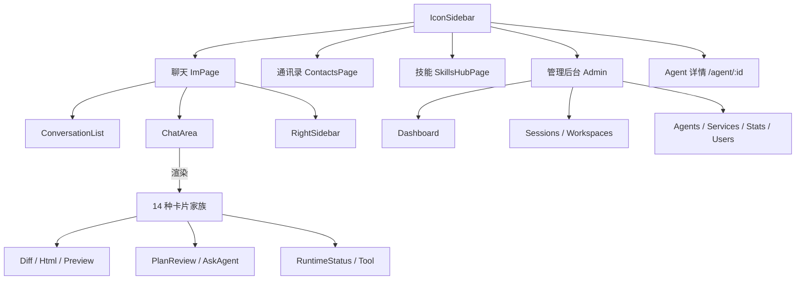

# 收尾 TODO

> 配套：[产品设计文档.md](./产品设计文档.md)

---

## 一、PRD 内可选精修

| # | 项 | 形式 | 对应章节 |
|---|----|------|----------|
| 1 | 产品信息架构图 | Mermaid `graph TD` | 6.1 末尾 |
| 2 | 用户端到端旅程图 | Mermaid `journey` | 3.3 末尾 |

**信息架构图骨架**（可直接复制到 6.1 末尾）：

---

## 二、答辩演示物料（不属于 PRD）

| # | 项 | 说明 |
|---|----|------|
| 1 | 演示截图 6-8 张 | 用于答辩 PPT |
| 2 | 3 分钟 Demo 视频 | 课题硬性要求 |
| 3 | 可运行 Demo | 已交付（`make dev` 一键启动三端） |

**建议截图场景**：

| 场景 | 视图 | 对应 |
|------|------|------|
| 单聊流式 | Claude Code 输出代码 + 光标 | 场景 A |
| 群聊编排 | Orchestrator 规划卡 + 多 Agent | 场景 B |
| 跨 Agent 记忆 | @Codex 续写 | 场景 C |
| Diff 应用 | 多 Tab + [应用] 按钮 | FR-AR-01 |
| HTML 卡内联预览 | 落地页产物 | FR-AR-02 |
| SkillsHub | 内置 + 外置列表 | FR-SK |
| Agent 详情 | SOUL.md 编辑 | FR-AD-06 |
| 管理后台 | 资源仪表盘 | 9.9.1 |
