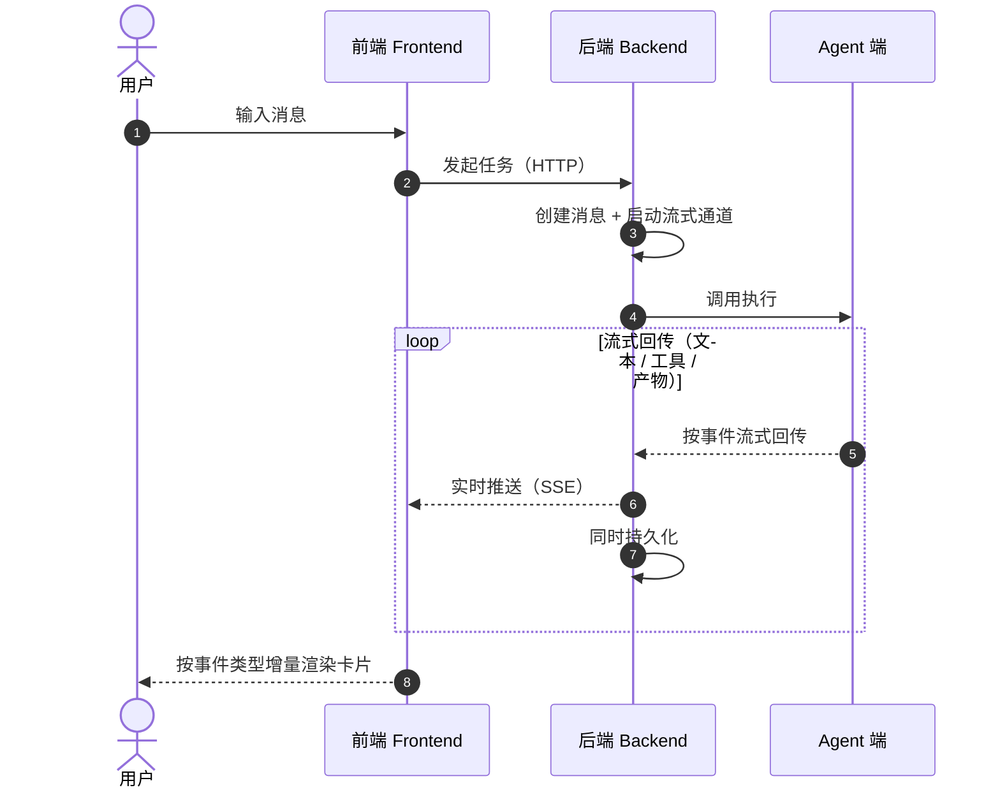
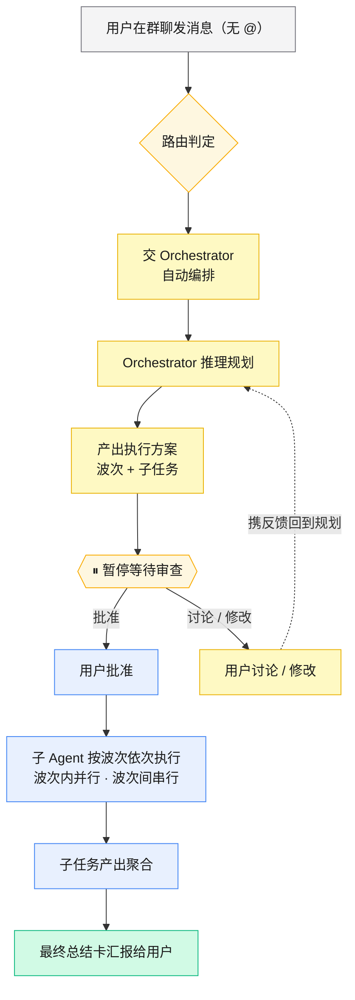
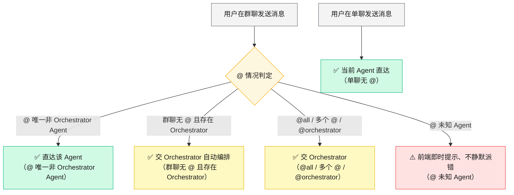
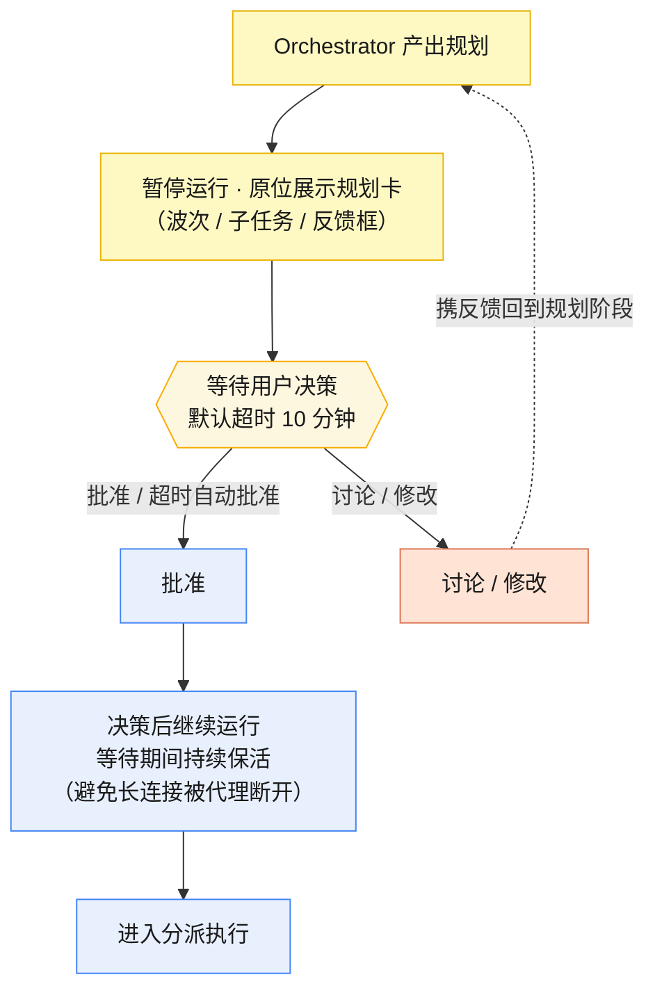
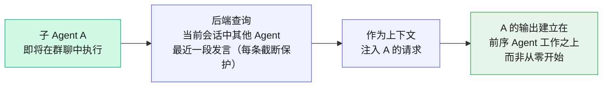
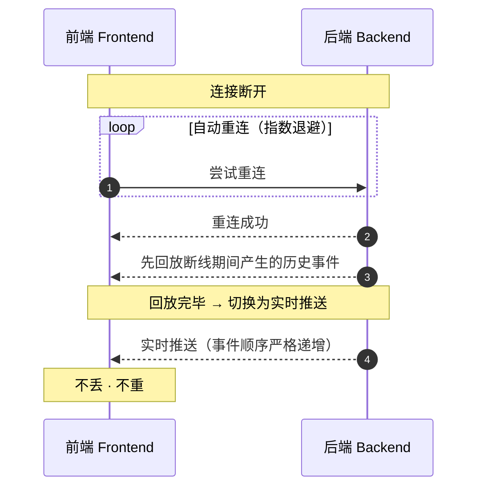

# 流程设计图（Mermaid）

> 来源：[产品设计文档.md §7 流程设计](../产品设计文档.md)（行 281–355）。
> 共 6 张图：§7.1 单聊流式输出、§7.2 群聊编排、§7.3 消息路由、§7.4 规划审查、§7.5 跨 Agent 记忆注入、§7.6 断线重连。
> 时序型流程（7.1 / 7.6）用 `sequenceDiagram`，分支型流程（7.2–7.5）用 `flowchart`。

## 一、单聊流式输出流程（§7.1）

## 二、群聊编排流程（§7.2）

## 三、消息路由决策流程（§7.3）

## 四、规划审查流程（§7.4）

## 五、跨 Agent 记忆注入流程（§7.5）

## 六、断线重连流程（§7.6）

## 设计要点

### 单聊流式输出（图一）
- **三端时序**：`sequenceDiagram` 清晰呈现「用户 → 前端 → 后端 → Agent 端」的请求链路与反向事件回流，对应 [SSE 流式架构](../../../design/sse-streaming-architecture.md) 的三端全链路。
- **中转双写**：后端在 `loop` 内**同时**做两件事——向前端实时推送（SSE）+ 持久化，保证推送与落库不脱节（FR-SSE-01）。
- **增量渲染**：前端「按事件类型增量渲染卡片」，即每类事件（文本 / 工具 / 产物）映射为不同卡片家族。

### 群聊编排（图二）
- **暂停审查点**：菱形节点 `⏸ 暂停等待审查` 是人工介入闸口，批准才进入执行；讨论 / 修改走虚线反馈回到规划，形成「规划 ⇄ 审查」迭代回路（对应 FR-OR-04 不可绕过审查）。
- **波次执行**：子 Agent「波次内并行、波次间串行」用单一执行节点 + 文案标注，避免在静态图里画并发细节（对应 FR-OR-02 波次可视化）。
- **闭环**：最终聚合到「总结卡汇报」，与 [Orchestrator 编排设计](../../../design/03-orchestrator-plan-review.md) 一致。

### 消息路由（图三）
- **双入口**：群聊与单聊两条独立起点，群聊入口挂一个 4 分支判定菱形，覆盖 `@唯一非 Orchestrator` / 无 @ / @all·多 @·@orchestrator / @未知 四种情况（对应 [Agent 路由与分派](../../../design/09-agent-routing-and-dispatch.md)）。
- **颜色即语义**：直达 = 绿、交 Orchestrator = 黄、@未知 = 红，让「派给谁」一眼可辨（对应「色彩靠功能」原则）。
- **不静默派错**：@未知 Agent 命中红色「前端即时提示」，而非静默路由到错误目标。

### 规划审查（图四）
- **决策三出口**：`等待` 菱形引出批准、讨论/修改、超时三条边——**超时自动批准**直接并入批准边，体现默认放行策略。
- **重规划回路**：讨论/修改虚线回到「产出规划」重新推理，非丢弃原方案。
- **边界处理（未入图）**：① 超时 10 分钟自动批准；② 进程异常时，下次重进可恢复至等待状态——这两条以文案承载，避免污染主流程时序。

### 跨 Agent 记忆注入（图五）
- **横向链路**：用 `LR` 方向凸显「查询 → 注入 → 输出」三段线性流程，后端承担查询与注入（brand 色强调中介角色）。
- **截断保护**：查询节点标注「每条截断保护」，防止前序发言过长撑爆上下文窗口（对应 [跨 Agent 记忆设计](../../../design/02-group-chat-cross-agent-memory.md)）。
- **退化与隔离（未入图）**：单聊仅 1 个 Agent，此流程自然为空；波次串行处理天然保证波次间窗口隔离。

### 断线重连（图六）
- **协议时序**：`sequenceDiagram` 还原「断开 → 重连 → 回放 → 实时」握手过程，`loop` 体现指数退避重试。
- **回放优先**：重连成功后**先回放断线期间历史事件**，再切实时推送，二者顺序不可颠倒（对应 [SSE 性能与渲染修复](../../../bugfix/sse-streaming-performance-and-rendering.md) 的断线续传保障）。
- **不丢不重**：依靠「事件顺序严格递增」的序号，最终收敛到「不丢 · 不重」不变式。
