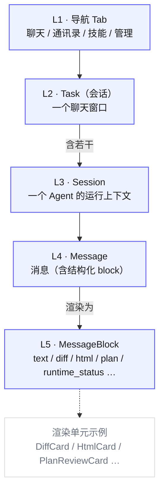

# 信息架构图（Mermaid）

> 来源：[产品设计文档.md §6 信息架构](../产品设计文档.md)（行 239–279）。
> 含两张图：§6.1 全局导航结构骨架、§6.2 信息层级 L1–L5。

## 一、全局导航结构（§6.1）

```mermaid
flowchart TD
    Root["🚀 AgentHub · Web SPA"]

    Root --> Nav["🧭 Icon Sidebar（56px 主导航）"]
    Nav --> Chat["💬 聊天 · ImPage<br/>（默认主页）"]
    Nav --> Contacts["👥 通讯录 · ContactsPage"]
    Nav --> Skills["🧩 技能 · SkillsHubPage"]
    Nav --> Admin["📊 管理后台 · Admin<br/>（需密码验证）"]
    Nav --> Agent["🧬 Agent 详情页<br/>/agent/:sessionId"]
    Nav --> Settings["⚙ 设置"]

    Chat --> CL["左 · ConversationList<br/>会话列表 + 搜索"]
    Chat --> CA["中 · ChatArea<br/>消息流 + 输入框"]
    Chat --> RS["右 · RightSidebar<br/>置顶 / 退群 / 成员 / SOUL.md"]
    CA --> CardFamily["📨 14 种消息卡片家族"]
    CardFamily --> FC1["只读展示<br/>文本 / Runtime / Image / Attachment / Summary / Tool"]
    CardFamily --> FC2["内联 / 全屏预览<br/>Html / Preview"]
    CardFamily --> FC3["Diff · 多文件 Tab + [应用]"]
    CardFamily --> FC4["用户决策<br/>PlanReview / AskAgent"]

    Contacts --> CT1["📌 置顶区（pinnedAt 排序）"]
    Contacts --> CT2["📁 自定义分组（可折叠）"]
    Contacts --> CT3["未分组区"]

    Skills --> SK1["内置 Skill · render / taskctl<br/>（不可删改）"]
    Skills --> SK2["外置 Skill · 上传 / 导入 / 移除"]

    Admin --> AM["AdminMenu · 180px 二级菜单"]
    AM --> AD1["总览 Dashboard"]
    AM --> AD2["会话清理"]
    AM --> AD3["工作区"]
    AM --> AD4["Agent"]
    AM --> AD5["服务健康"]
    AM --> AD6["数据统计"]
    AM --> AD7["用户管理"]

    Agent --> AP1["基础信息 · 头像 / 名称 / Agent 类型"]
    Agent --> AP2["SOUL.md 编辑 · ≤ 300 字"]
    Agent --> AP3["Skills 区域 · 内置 + 外置"]

    classDef root fill:#eef2ff,stroke:#6366f1,stroke-width:2px,color:#1a1a1a;
    classDef nav fill:#f4f4f5,stroke:#71717a,color:#1a1a1a;
    classDef chat fill:#e8f0fe,stroke:#4285f4,color:#1a1a1a;
    classDef contacts fill:#fef9c3,stroke:#eab308,color:#1a1a1a;
    classDef skills fill:#d1fae5,stroke:#10b981,color:#1a1a1a;
    classDef admin fill:#ffe4d6,stroke:#da7756,color:#1a1a1a;
    classDef agent fill:#ede9fe,stroke:#8b5cf6,color:#1a1a1a;
    classDef leaf fill:#ffffff,stroke:#d4d4d8,color:#3f3f46;

    class Root root;
    class Nav,Settings nav;
    class Chat,CL,CA,RS,CardFamily chat;
    class Contacts,CT1,CT2,CT3 contacts;
    class Skills,SK1,SK2 skills;
    class Admin,AM,AD1,AD2,AD3,AD4,AD5,AD6,AD7 admin;
    class Agent,AP1,AP2,AP3 agent;
    class FC1,FC2,FC3,FC4 leaf;
```

## 二、信息层级 L1–L5（§6.2）

## 设计要点

### 全局导航结构（图一）
- **根 → 主导航 → 主视图**：以 `Icon Sidebar` 为唯一入口，切换 4 个主视图（聊天 / 通讯录 / 技能 / 管理）+ 独立路由的 Agent 详情页，对齐 §9.1「4 主视图 + 1 独立路由」结构。
- **聊天页三栏**：左 `ConversationList` / 中 `ChatArea` / 右 `RightSidebar`；`ChatArea` 渲染 14 种消息卡片家族，按交互模式归为 4 类（对应 §8.3、§9.5）。
- **管理后台**：需密码二次验证后进入 `AdminMenu`（180px），下挂 7 个管理页（§9.9.1–9.9.7）。
- **配色按视图分组**：聊天（蓝）/ 通讯录（黄）/ 技能（绿）/ 管理（橙）/ Agent 详情（紫），描边色取自 §8.6 视觉风格规范的 Agent 标识色（Claude `#DA7756` / OpenCode `#10B981` / Orchestrator `#EAB308` / Codex `#6366F1`），节点为浅色填充 + 同色描边，遵循「层级靠色阶、色彩靠功能」。

### 信息层级（图二）
- **Task ⊃ Session**：一个聊天窗口（Task）含若干 Session，每个 Session 是单个 Agent 的运行上下文（对应 §12.1 术语表）。
- **Message → MessageBlock**：消息在 L5 展开为渲染单元，即 §9.5 卡片家族的实例（text / diff / html / plan / runtime_status …）。

### 会话列表组织规则（§6.3）
- **排序**：置顶优先，再按最近活跃时间倒序。
- **分组**：未归入自定义分组的会话进入「未分组」区域。
- **搜索**：按会话标题 / Agent 名称模糊匹配。
