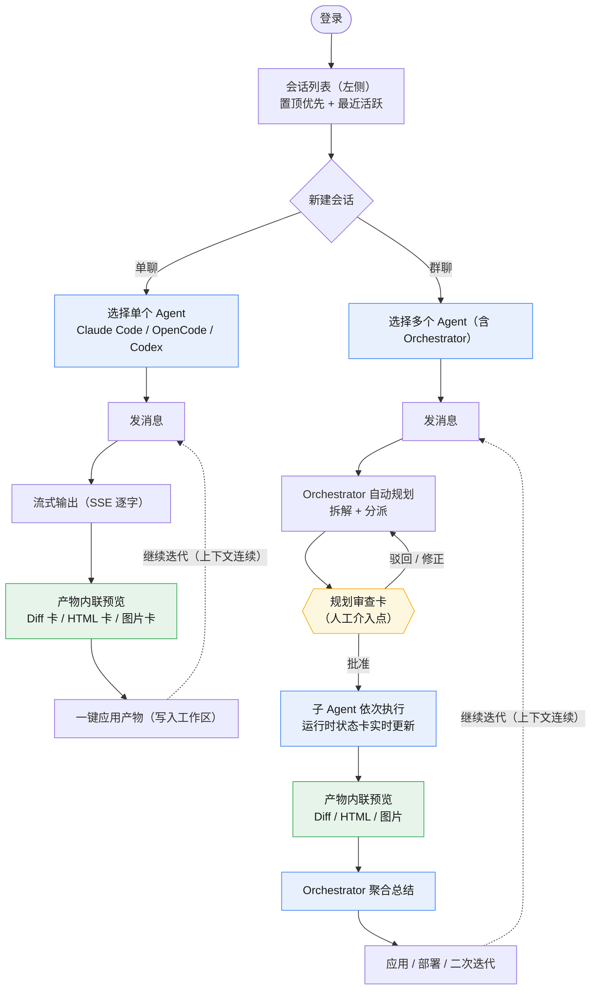

# 用户旅程流程图（Mermaid）

> 来源：[产品设计文档.md §3.3 典型用户旅程（端到端）](../产品设计文档.md)（行 112–121）。
> 同主题可交互版本见 [user-journey-flow.html](../user-journey-flow.html)。

## 端到端用户旅程

## 设计要点

- **分支结构**：菱形判断节点「新建会话」拆出单聊 / 群聊两条主线（对应 FR-IM-02，群聊必须可包含 Orchestrator）。
- **人工介入**：`规划审查卡` 用菱形 + 黄色高亮，强调「批准 → 继续 / 驳回 → 重规划」的决策点（对应 FR-OR-04，每次执行前必审、不可绕过）。
- **运行时状态卡**：子 Agent 节点标注「实时更新」，体现群聊中各 Agent 像群成员依次发言的过程可见性（对应 FR-OR-02 波次可视化）。
- **产物卡**：两类分支都收敛到 Diff / HTML / 图片三类内联产物，绿色高亮（对应 FR-AR-01/02/03）。
- **二次迭代回路**：虚线箭头连回「发消息」，表示上下文连续、可多轮迭代修改（对应 FR-IM-04）。
